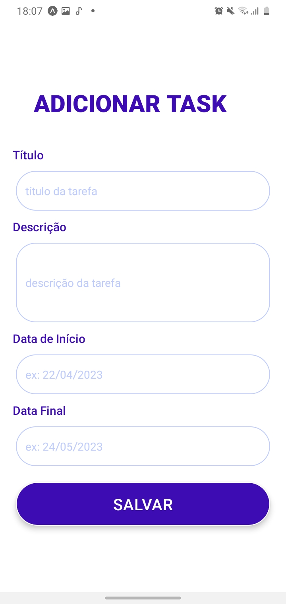
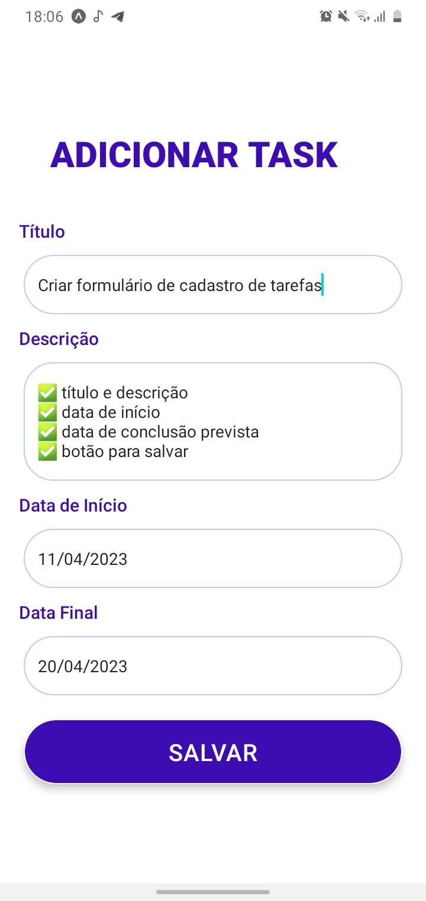

<h1 align="center"> Documentação do Formulário de Cadastro de Tarefas</h1>

<p align="justify"> O formulário de cadastro de tarefas foi criado para que o usuário possa criar uma tarefa com alguns detalhes como, descrição da tarefa, data de início e data de conclusão prevista.</p>

<h2> Inputs</h2>
<p align="justify"> Foram criados quatro Inputs para os campos: título da tarefa, descrição da tarefa, data inical da tarefa e data de conclusão prevista para aquela tarefa. Em cada Input será fornecido ao usuário uma dica do valor a ser digitado, o valor será armazenado. No Input do description, usaremos a funcionalidade numberOfLine e multiline para fazer a entrada de texto em várias linhas e poder visualizar o texto organizado no input.Todos os Inputs serão estilizados da mesma forma, com exceção do input de description que terá uma altura maior.</p>

```
        <Text style={styles.subtext}>Título</Text>
        <TextInput // Input do título
          placeholder="título da tarefa"
          placeholderTextColor="#becbff"
          style={styles.textInput}
          onChangeText={setTitle}
          value={title}
        />

        <Text style={styles.subtext}>Descrição</Text>
        <TextInput // Input da descrição
          placeholder="descrição da tarefa"
          placeholderTextColor="#becbff"
          style={styles.descriptionInput}
          onChangeText={setDescription}
          value={description}
          numberOfLines={10}
          multiline={true}
        />

        <Text style={styles.subtext}>Data de Início</Text>
        <TextInput // Input da data inicial
          placeholder="ex: 22/04/2023"
          placeholderTextColor="#becbff"
          style={styles.textInput}
          onChangeText={setInitialDate}
          value={initialdate}
        />

        <Text style={styles.subtext}>Data Final</Text>
        <TextInput // Input da data final
          placeholder="ex: 24/05/2023"
          placeholderTextColor="#becbff"
          style={styles.textInput}
          onChangeText={setFinalDate}
          value={finaldate}
        />
```

<h2> Button </h2>
<p align="justify"> Usaremos do TouchableOpacity para que responda com opacidade quando clicar no botão SALVAR, quando o botão for clicado, todos os dados serão puxados e mostrados no terminal. Foram criados dois blocos de estilização para estilizar ao botão e ao texto do botão.</p>

```
        <TouchableOpacity style={styles.formButton} onPress={handleSignIn}>
          <Text style={styles.buttonText}>SALVAR</Text>
        </TouchableOpacity>
```

<h1>Estilização</h1>
<p align="justify"> No elemento text temos alguns comandos de estilização como, o tamanho da fonte, peso ou intensidade,a cor, o alinhamento, e a distância entre o conteúdo e suas bordas.</P>

```
text: { //texto título = add task
    fontSize: 30,
    fontWeight: "800", 
    color: "#3E0CB3",
    alignItems: "center", 
    padding: 35,
    paddingHorizontal: 35
  },
```
<p align="justify"> No elemento subtext temos alguns comandos de estilização como, tamanho da fonte, peso ou intensidade, cor da fonte e espaço.

```
subtext:{
    fontSize: 15,
    fontWeight:"500",
    color: "#3E0CB3",  
    paddingLeft: 16        
  },
```

<p align="justify"> No elemento textInput e descriptionInput temos alguns comandos de estilização como, altura, borda da largura, cor da borda, a margin, borda arredondada, e a distância entre o conteúdo e suas bordas.</p>

```
textInput: { //inputs = caixinhas
    height: 50,
    borderWidth: 1,
    borderColor: "#becbff",
    marginHorizontal: 20,
    marginVertical: 10,
    borderRadius: 25,
    paddingLeft: 12
  },
  descriptionInput: { //estilização do input da descrição, alterou a altura
    height: 100,
    borderWidth: 1,
    borderColor: "#becbff",
    marginHorizontal: 20,
    marginVertical: 10,
    borderRadius: 25,
    paddingLeft: 12
  },
```

<p align="justify"> No elemento formButton temos alguns comandos de estilização como, cor de fundo do botão, altura, alinhamento, borda arredondada, margem, borda de largura, cor da borda, estilização de sombra do botão.</p>

```
  formButton: {
    backgroundColor: "#3E0CB3",
    height: 55,
    alignItems: "center",
    justifyContent: "center",
    borderRadius: 35,
    marginHorizontal: 20,
    marginVertical: 10,
    borderWidth: 1,
    borderColor: "white",
    shadowColor: "#000", 
    shadowOffset: {
      width: 0,
      height: 4
    },
    shadowOpacity: 0.25,
    shadowRadius: 3.84,
    elevation: 5
  },
```
<p align="justify">No elemento buttonText temos alguns comandos de estilização para o texto do botão como, tamanho da fonte, largura da fonte, a cor e o espaçamento entre as letras.</p>

``` 
  buttonText: {
    fontSize: 20,
    fontWeight: "600",
    color: "white",
    letterSpacing: 0.5
  },
```
<h1>RESULTADO<h1>




<h2>Conclusão</h2>
<p align="justify"> O formulário de cadastro de tarefa compõem quatro campos de Input, onde o usuário poderá digitar dados, como: título, descrição, data inicial e data final da tarefa. Possui um botão que ao ser tocado pelo usuário, seus dados serão enviados, e mostrados no terminal.</p>
